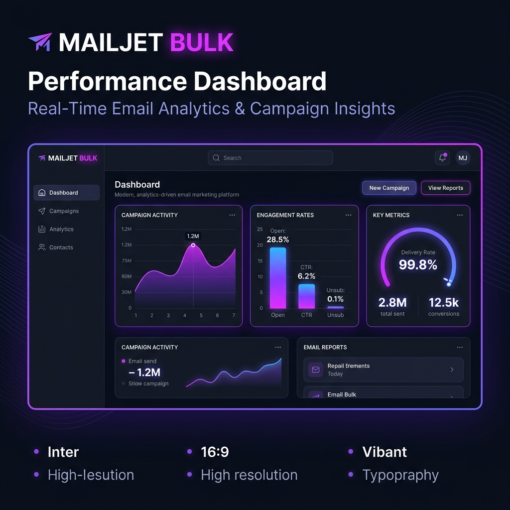
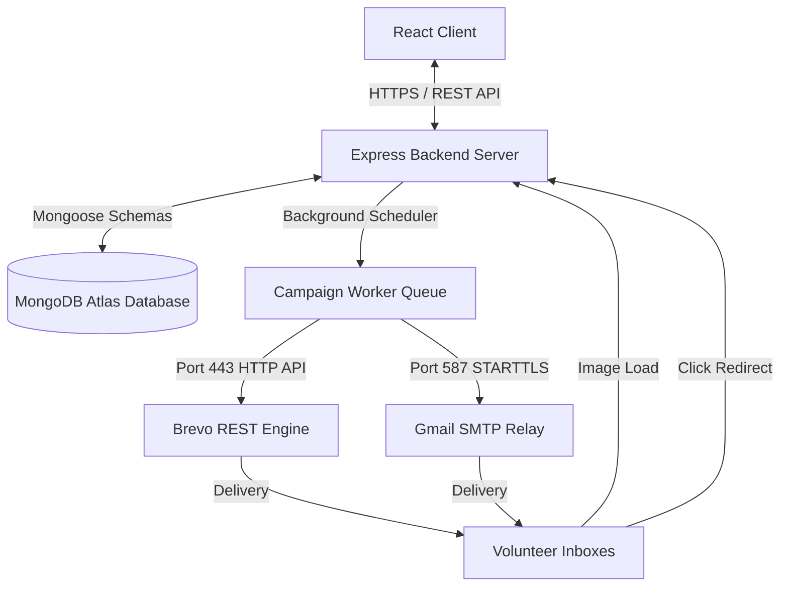

#                                                🚀 MailJet Bulk Email Platform

<p align="center">
  
</p>

<p align="center">
  
  
  
  
  
  
</p>

---

## 🌟 Overview

**MailJet Bulk** is a premium, full-stack bulk email marketing and dispatch application designed for scaling outreach campaigns, such as **Hackathon Invitations** and **Volunteer Coordination**. 

Featuring real-time analytics dashboards, responsive light/dark mode styling, customizable HTML templates, and automated retry workers, it bypasses traditional SMTP blocks by integrating directly with standard cloud delivery HTTP APIs like **Brevo** and **Resend**.

---

## ⚡ Core Features

- **📊 Advanced Analytics**: Real-time tracking of sent emails, opens, link clicks, bounce rates, and delivery success graphs.
- **📱 Responsive Layout**: Fully responsive, mobile-first design utilizing Tailwind CSS with a dedicated mobile bottom navigation bar.
- **🎨 HTML Template Manager**: Design rich volunteer/hackathon invitation templates with live previews. Pre-seeded with a custom *Hackathon Volunteer Invitation* template.
- **📂 CSV Recipient Uploader**: Parse bulk recipient lists instantly with support for dynamic custom fields (e.g. `{name}`, `{role}`).
- **🔄 Fault-Tolerant Queue**: Background job processor in Node.js that schedules campaigns, retries failed sends, and avoids connection freezes with custom timeouts.
- **🔒 Secure JWT Auth**: Built-in authentication, registration flow, and session persistence.
- **💡 Dual-Mode Delivery**: Transparently switches between local Gmail SMTP connections and cloud-based HTTP APIs (Brevo/Resend) over port `443` to ensure uninterrupted email dispatch.

---

## 🏗️ System Architecture



---

## ⚙️ Quick Start Setup

### 1. Prerequisites
Ensure you have **Node.js** (v18+) and **MongoDB** installed locally.

### 2. Installation
Clone this repository and install the dependencies:
```bash
# Install frontend dependencies
npm install

# Install backend dependencies
cd backend
npm install
```

### 3. Environment Variables Config

Create a `.env` file in your `backend/` directory:
```env
PORT=5000
MONGODB_URI=mongodb+srv://<user>:<password>@cluster.mongodb.net/bulk_email_sender
JWT_SECRET=your_super_secret_session_key
NODE_ENV=development
FRONTEND_URL=http://localhost:5173
BACKEND_URL=http://localhost:5000

# Brevo HTTP API (Recommended for Cloud Hosting)
BREVO_API_KEY=xkeysib-your_brevo_api_key
EMAIL_FROM=your-verified-email@gmail.com
EMAIL_FROM_NAME="Hackathon Organizer"
```

---

## 🚀 Running Locally

Start the backend and frontend development servers concurrently:

```bash
# Start Backend (from backend/ directory)
npm run dev

# Start Frontend (from root directory)
npm run dev
```

Open **`http://localhost:5173`** in your browser.

---

## 🌐 Production Deployment

### Backend (Render / Railway)
1. Link your backend GitHub repository to **Render** as a *Web Service*.
2. Add your environment variables in the Render Dashboard (use `PORT=10000`).
3. Set `FRONTEND_URL` to your live Vercel URL (e.g. `https://your-app.vercel.app`).

### Frontend (Vercel / Netlify)
1. Deploy your frontend to **Vercel**.
2. Define the environment variable **`VITE_API_URL`** pointing to your live backend endpoint:
   `VITE_API_URL=https://your-backend.onrender.com/api`

---

## 🛡️ License
Distributed under the MIT License. See `LICENSE` for more information.
